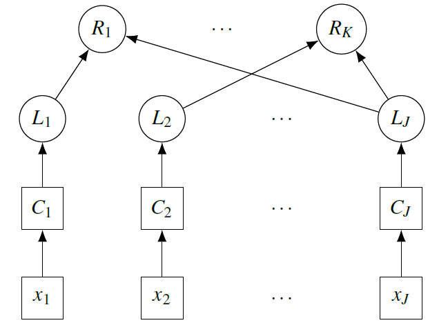

# pRSL: Interpretable Multi-label Stacking by Learning Probabilistic Rules

This repo contains the most recent version of pRSL as an R implementation. pRSL is a stacking approach to combine the labels of several underlying machine learning models via interpretable rules. These rules can either in a zero-shot setting be expert-given, or learned from possibly incomplete data. To see examplary usages of pRSL, feel free to check out the paper, or the benchmarks (on six datasets with up to 100 labels), or the transfer learning application linked below. 

This repo contains:
- rsl.R - the main pRSL code
- norn.R - the code for approximate inference in pRSL
- dirichletCalibration.R - code for calibrating your machine learning models, as recommended before applying pRSL
- unit and end-to-end tests...

I'm interested to learn how you use or benchmark against pRSL, so it would be great if you sent me a small heads-up in that case.

# Further Resources:

- Main pRSL code repo (with up-to-date version of pRSL): https://github.com/mkirchhof/rsl
- Approximate inference experiments: https://github.com/mkirchhof/rslSim
- Benchmarks of pRSL on multi-label datasets: https://github.com/mkirchhof/rslBench
- Application of pRSL for transfer learning in human activity recognition: https://github.com/mkirchhof/rslAppl
- Paper on pRSL: Kirchhof, M., Schmid, L., Reining, C., ten Hompel, M., Pauly, M.: pRSL: Interpretable Multi–label Stacking by Learning Probabilistic Rules. In: Proceedings of the 37th Conference on Uncertainty in Artificial Intelligence, PMLR, in press (2021).
